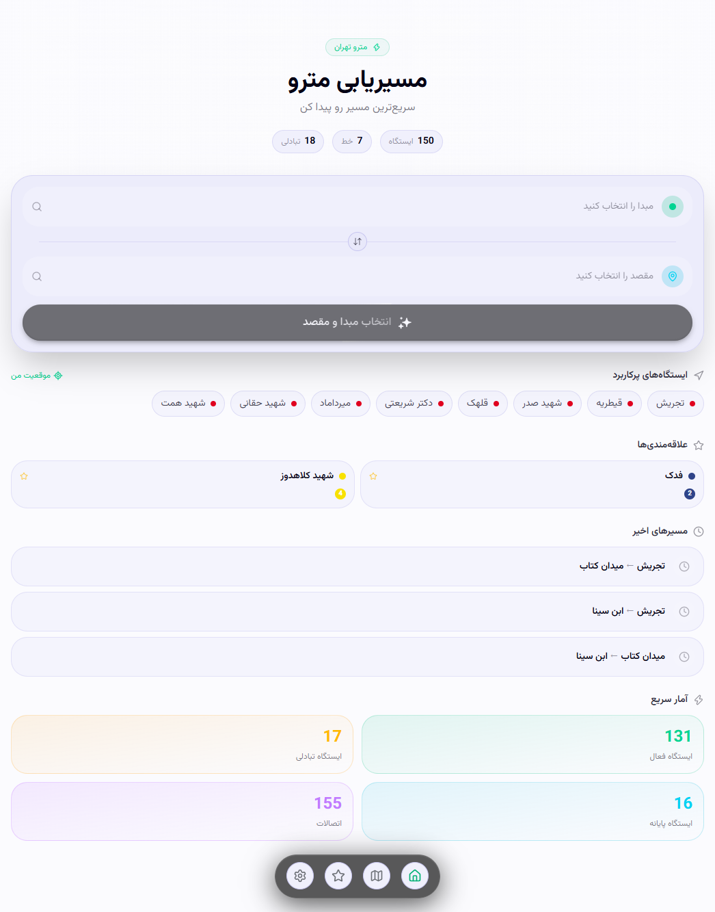
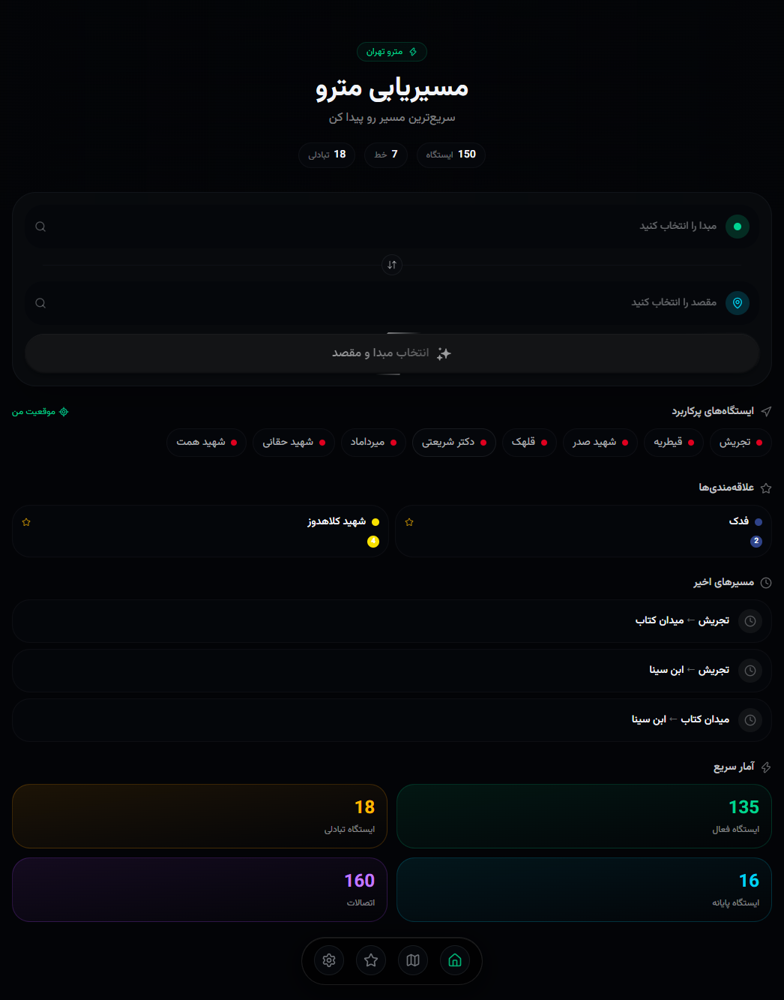
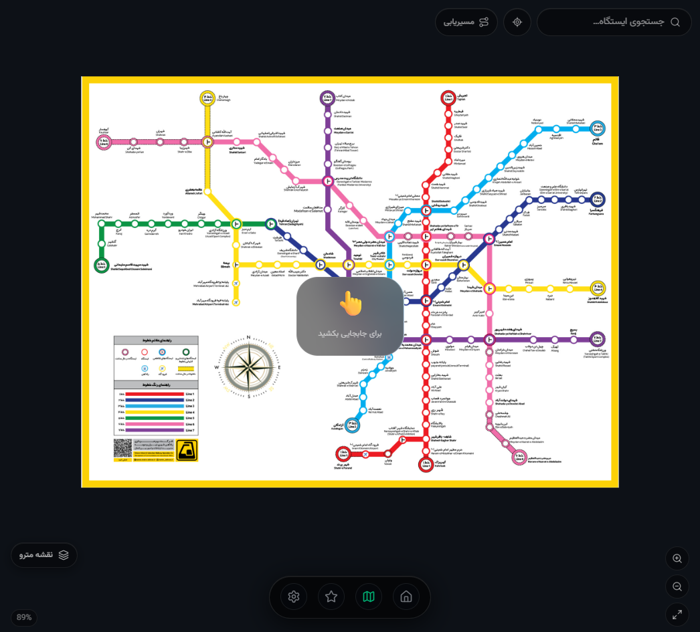
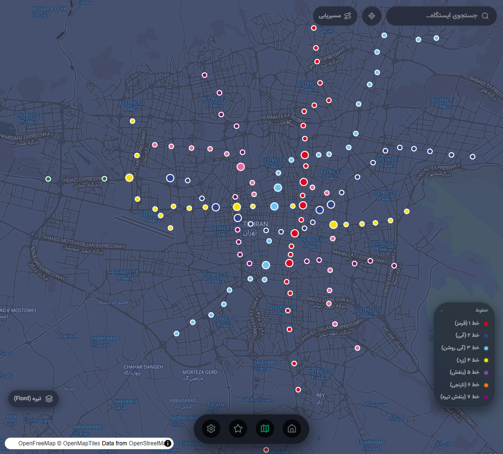
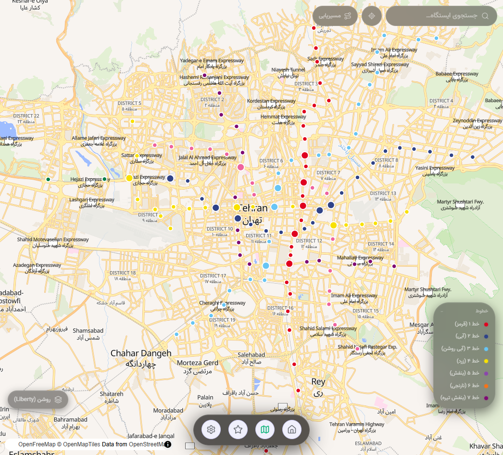
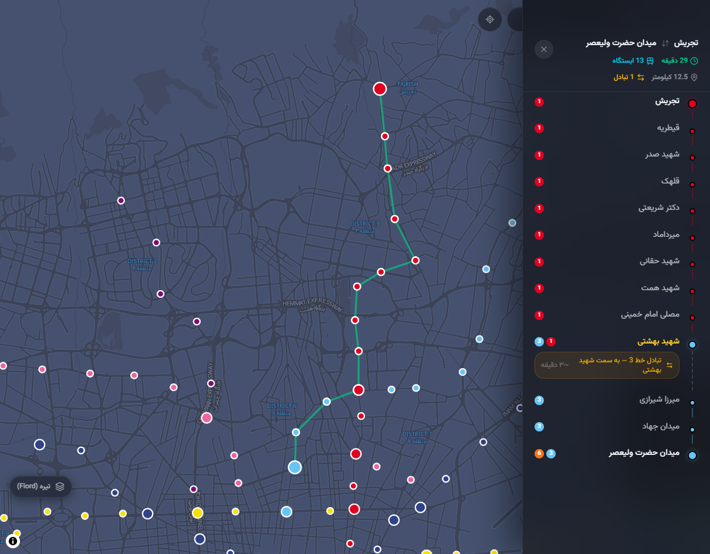
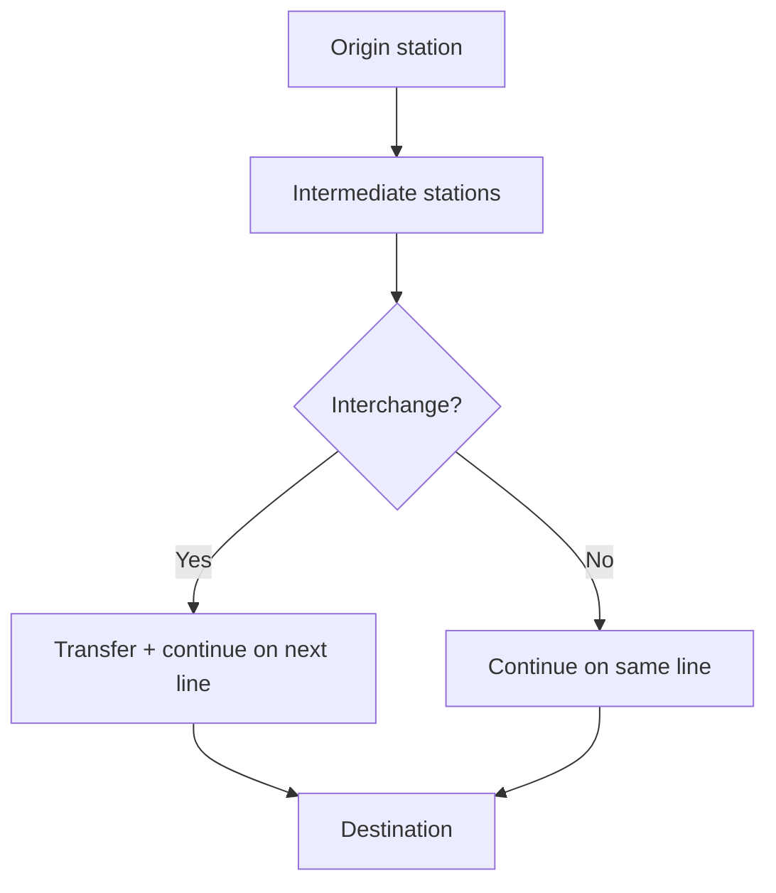

# 🚇 Tehran Metro — Tehran Subway Map & Smart Route Planner

**A modern Persian-first web app for Tehran Metro navigation, station search, and route planning.**

> یک وب‌اپلیکیشن مدرن برای **نقشه مترو تهران**، جستجوی ایستگاه‌ها، مسیریابی بین ایستگاه‌ها و برنامه‌ریزی سفر با رابط کاربری فارسی (RTL) و واکنش‌گرا.

<p align="center">
  <a href="YOUR_LIVE_DEMO_URL"></a>
  <a href="https://github.com/HamedFarazi/metroapp"></a>
</p>

<p align="center">
  
  
  
  
  
  
</p>

---

## 📱 Screenshots

|                                                       Home (light)                                                       |                                                              Home (dark)                                                              |                                                         Static metro map                                                          |
| :----------------------------------------------------------------------------------------------------------------------: | :-----------------------------------------------------------------------------------------------------------------------------------: | :-------------------------------------------------------------------------------------------------------------------------------: |
|  |  |  |

|                                                     Interactive map (Fiord)                                                     |                                                     Interactive map (Liberty)                                                      |                                                              Route on map                                                               |
| :-----------------------------------------------------------------------------------------------------------------------------: | :--------------------------------------------------------------------------------------------------------------------------------: | :-------------------------------------------------------------------------------------------------------------------------------------: |
|  |  |  |

|                                          Dark mode home (mobile)                                          |                                                      Map layer switcher                                                       |
| :-------------------------------------------------------------------------------------------------------: | :---------------------------------------------------------------------------------------------------------------------------: |
|  |  |

---

## 📑 Table of Contents

- [Overview](#-overview)
- [Features](#-features)
- [Online / Offline Behavior](#-online--offline-behavior)
- [Routing Algorithm](#-routing-algorithm)
- [Architecture](#-architecture)
- [Tech Stack](#-tech-stack)
- [Data](#-data)
- [Data Attribution](#-data-attribution)
- [Map Technology](#-map-technology)
- [Performance](#-performance)
- [Accessibility](#-accessibility)
- [Internationalization](#-internationalization)
- [PWA](#-pwa)
- [Installation](#-installation)
- [Environment Variables](#-environment-variables)
- [Roadmap](#-roadmap)
- [Contributing](#-contributing)
- [Community & Support](#-community--support)
- [Author](#-author)
- [License](#-license)
- [Acknowledgments](#-acknowledgments)
- [Project Keywords](#-project-keywords)

---

## 🧭 Overview

**🇬🇧 English**

**Tehran Metro** is a public-transportation web application for exploring the **Tehran Subway** network. It helps riders search stations, plan trips between origin and destination, inspect transfers, and view the network on a static metro schematic or an interactive geographic map.

|                      |                                                           |
| -------------------- | --------------------------------------------------------- |
| **Category**         | Public transportation / metro navigation / route planning |
| **Platform**         | Web application (installable PWA)                         |
| **Primary location** | Tehran, Iran                                              |
| **UI language**      | Persian (Farsi), RTL                                      |
| **Core purpose**     | Tehran Metro map + route planner                          |
| **Stack**            | React + TypeScript + Vite                                 |

**🇮🇷 فارسی**

این پروژه یک وب‌اپلیکیشن فارسی‌محور برای **نقشه مترو تهران** و **مسیریابی مترو** است: انتخاب مبدأ و مقصد، نمایش مسیر پیشنهادی (زمان تقریبی، تعداد ایستگاه، تبادل خط)، جستجوی ایستگاه، علاقه‌مندی‌ها، و نقشه تعاملی.

---

## ✨ Features

### 🚇 Metro Map

- Static **Tehran Metro lines map** (`metromap.jpg`) with zoom/pan (works without live tiles)
- Interactive geographic map with MapLibre GL
- Layer switcher: Metro schematic, OpenFreeMap Fiord/Liberty, MapTiler Satellite
- Color-coded station markers and line legend
- Route polyline overlay on the map (desktop)

### 🧭 Route Planning

- Choose **origin** and **destination** stations
- Shortest path by fewest station hops (BFS)
- Route summary: estimated travel time, distance, station count, transfer count
- Line segments with line colors/labels
- Interchange stations highlighted with transfer guidance
- Full intermediate station sequence
- Recent routes saved locally (up to 10)

### 🚉 Stations

- **150** stations in the dataset (**135** active)
- Coordinates, addresses, line membership, and amenities
- Station detail sheets (mobile + desktop layouts)
- Optional station photos when available (local WebP assets)

### 🔎 Search

- Fast station search by Persian and English names
- Dedicated search panel for origin, destination, or browse mode

### ⭐ Favorites & Personalization

- Favorite stations persisted in local storage
- Favorites page for quick access
- Themes: light, dark and system
- Geolocation → nearest stations (“موقعیت من”)

### 📱 Responsive UI

- Mobile-first layout with bottom navigation
- Desktop floating dock
- Bottom sheets / side panels adapted by viewport

### 📲 PWA

- Web app manifest (Persian, RTL)
- Service worker via `vite-plugin-pwa`
- Install prompt support (where the browser allows it)

---

## 🌐 Online / Offline Behavior

This app provides **limited offline support**, not a fully offline product.

| Capability                                        |                      Offline                       |     Online      |
| ------------------------------------------------- | :------------------------------------------------: | :-------------: |
| App shell (JS/CSS/HTML) after first visit         |                   ✅ (PWA cache)                   |       ✅        |
| Bundled metro JSON (stations, lines, connections) |                         ✅                         |       ✅        |
| Route calculation (local graph)                   |                         ✅                         |       ✅        |
| Static metro schematic map                        |                         ✅                         |       ✅        |
| OpenFreeMap / MapTiler tiles & satellite          | ❌ (needs network; tiles may fall back from cache) |       ✅        |
| Tehran weather (Open-Meteo)                       |                         ❌                         |       ✅        |
| Connectivity status UI (`navigator.onLine`)       |                         —                          | Not implemented |

**Note:** In the UI, “آفلاین / Offline” refers to the **static metro map layer mode**, not automatic network detection.

---

## 🧮 Routing Algorithm

Pathfinding uses **Breadth-First Search (BFS)** over an unweighted station graph — minimizing the number of hops between stations.

### Graph model

| Concept           | Implementation                                                          |
| ----------------- | ----------------------------------------------------------------------- |
| **Nodes**         | Station IDs                                                             |
| **Edges**         | Bidirectional links from `connectedStationIds` / connections            |
| **Edge weights**  | None in BFS (hop count)                                                 |
| **Transfers**     | Detected when consecutive hops change metro lines                       |
| **Time estimate** | Haversine distance @ ~40 km/h + ~30s dwell/station + 3 min per transfer |

Travel times are **estimates**, not official Tehran Metro schedules.



Core implementation: `src/services/metro-data.service.ts` (`findPath`) and `src/services/metro-route.service.ts` (`calculate`).

---

## 🏗️ Architecture

The UI is organized around feature folders and a single Zustand store. Navigation between Home / Map / Favorites is tab-based (not React Router).

```
src/
├── App.tsx                 # Tab shell, lazy pages, global overlays
├── main.tsx                # Bootstrap + theme init
├── pages/                  # HomePage, MapPage, FavoritesPage
├── features/
│   ├── route/              # RouteSheet
│   ├── search/             # SearchPanel
│   └── station/            # Station sheets, images, amenities
├── components/
│   ├── layout/             # BottomNav
│   ├── shared/             # LineBadge, …
│   └── ui/                 # shadcn/Radix primitives + custom UI
├── store/                  # Zustand (favorites, route, map mode, …)
├── services/               # Metro data + route calculation
├── domain/                 # Domain models (architecture layer)
├── data/processed/         # stations.json, lines.json, connections.json
├── hooks/                  # useGeolocation, usePWAInstall, useMediaQuery
└── types/                  # Shared TypeScript types
```

**State highlights (`metro.store.ts`):** active tab, origin/destination, current route, selected station, map mode, favorites, recent routes (persisted).

---

## 🛠️ Tech Stack

| Technology                      | Purpose                                  |
| ------------------------------- | ---------------------------------------- |
| **React 19**                    | UI library                               |
| **TypeScript**                  | Type safety                              |
| **Vite 8**                      | Dev server & production build            |
| **React Compiler**              | Compile-time optimization (Babel preset) |
| **Tailwind CSS 4**              | Styling                                  |
| **shadcn/ui + Radix**           | Accessible UI primitives                 |
| **Zustand**                     | Client state + persistence               |
| **Framer Motion**               | Page/sheet animations                    |
| **MapLibre GL**                 | Interactive geographic map               |
| **react-zoom-pan-pinch**        | Static metro map gestures                |
| **Lucide React / Tabler Icons** | Icons                                    |
| **vite-plugin-pwa**             | Progressive Web App                      |
| **Vercel**                      | Deployment config (`vercel.json`)        |

---

## 📊 Data

Processed Tehran Metro dataset lives in `src/data/processed/`:

| Metric       | Value                          |
| ------------ | ------------------------------ |
| Stations     | **150** total (**135** active) |
| Lines        | **7** (Lines 1–7)              |
| Connections  | **160**                        |
| Interchanges | **18**                         |
| Terminals    | **16**                         |

**Station fields include:** id, English/Persian names, lines, coordinates, address, amenities, disabled flag, and connected station IDs.

**Lines (names from data):**

1. Red · 2. Blue · 3. Light Blue · 4. Yellow · 5. Purple · 6. Orange · 7. Dark Purple

Station photos are optional local WebP files under `public/stations/` (currently limited coverage; sourced via Wikimedia Commons tooling — see `WIKIMEDIA_IMAGES_README.md`).

---

## 🙏 Data Attribution

| Asset                     | Source / notes                                                                                                                          |
| ------------------------- | --------------------------------------------------------------------------------------------------------------------------------------- |
| **Application code**      | © Hamed Farazi — this repository                                                                                                        |
| **Metro network data**    | Derived from [mostafa-kheibary/tehran-metro-data](https://github.com/mostafa-kheibary/tehran-metro-data) (vendored under `githubfile/`) |
| **Upstream data license** | ODbL — see `githubfile/LICENSE.md`                                                                                                      |
| **Map tiles / styles**    | [OpenFreeMap](https://openfreemap.org/) styles; satellite via [MapTiler](https://www.maptiler.com/)                                     |
| **Map data**              | © [OpenStreetMap](https://www.openstreetmap.org/copyright) contributors (via OpenFreeMap / OpenMapTiles)                                |
| **Station images**        | Wikimedia Commons (where present); respect individual file licenses                                                                     |
| **Weather**               | [Open-Meteo](https://open-meteo.com/)                                                                                                   |

---

## 🗺️ Map Technology

The map page supports multiple view modes:

1. **Offline schematic** — `/metromap.jpg` + pinch/zoom (`react-zoom-pan-pinch`)
2. **Street / Liberty** — MapLibre GL + OpenFreeMap style URLs
3. **Satellite** — MapLibre GL + MapTiler style (requires `VITE_MAPTILER_KEY`)

Features: station markers from coordinates, search, locate-me, route drawing, flyTo/fitBounds, and a line legend.

When using online map layers, keep the OpenStreetMap attribution visible (as shown in the MapLibre footer).

---

## ⚡ Performance

Verified techniques in the codebase:

- **Lazy loading** of Home / Map / Favorites via `React.lazy` + `Suspense`
- **Code splitting** for page bundles
- **React Compiler** enabled in Vite
- **PWA precaching** of static assets; runtime caching for OpenFreeMap tiles and fonts
- **Local JSON dataset** — route math runs client-side without a backend

---

## ♿ Accessibility

Current support is **basic**, not a claimed WCAG certification:

- Some `aria-label` / `aria-current` usage in navigation
- Dialog-oriented patterns for sheets/panels
- RTL layout and readable Persian typography (Vazirmatn)

Keyboard coverage and systematic screen-reader testing are still improvement areas.

---

## 🌐 Internationalization

- **UI:** Persian-first, hardcoded Farsi strings, `lang="fa"` + `dir="rtl"`
- **Data:** stations include English names and Persian translations
- **Not a full i18n framework** (no locale switcher / message catalogs yet)

---

## 📲 PWA

Configured with `vite-plugin-pwa`:

- Manifest: name «مترو تهران»، Persian, RTL, standalone display
- Icons under `public/icons/`
- `registerType: "autoUpdate"`
- Install UX via `usePWAInstall` (Android/Chrome prompt; iOS guidance)

Installability depends on the browser and HTTPS hosting.

---

## 🚀 Installation

### Requirements

- **Node.js** 18+
- **pnpm** recommended (`pnpm-lock.yaml` is the lockfile of record)

### Setup

```bash
git clone https://github.com/HamedFarazi/metroapp.git
cd metroapp
pnpm install
pnpm dev
```

Other package managers also work (`npm install` / `yarn`), but pnpm is preferred.

### Scripts

| Command        | Description                  |
| -------------- | ---------------------------- |
| `pnpm dev`     | Development server (Vite)    |
| `pnpm build`   | Typecheck + production build |
| `pnpm preview` | Preview the production build |
| `pnpm lint`    | ESLint                       |

Optional data/image tooling: `migrate-data`, `images:fetch`, `images:local` (see `package.json` and `WIKIMEDIA_IMAGES_README.md`).

---

## 🔐 Environment Variables

Create a `.env` in the project root if you need online map extras:

| Variable                      | Required                       | Description                    |
| ----------------------------- | ------------------------------ | ------------------------------ |
| `VITE_MAPTILER_KEY`           | For satellite / MapTiler fonts | MapTiler API key               |
| `VITE_MAP_LAYER_DEFAULT_URL`  | Optional                       | Default map style URL override |
| `VITE_MAP_LAYER_DEFAULT_TYPE` | Optional                       | Default layer type             |
| `VITE_MAP_LAYER_DEFAULT_NAME` | Optional                       | Default layer label            |

Core route planning and the static metro map work without these keys. **Do not commit secrets.**

---

## 🗺️ Roadmap

### ✅ Completed

- Persian RTL home / map / favorites experience
- BFS route planner with transfers, time & distance estimates
- Station search (FA/EN)
- Favorites + recent routes (persisted)
- Dual map modes (schematic + MapLibre)
- Theme modes including Darya
- PWA manifest + service worker
- Geolocation → nearest stations
- Processed 7-line Tehran Metro dataset

### 🚧 In Progress

- Broader station image coverage
- Polishing map UX across mobile/desktop

### 🗺️ Planned

- Weighted routing (travel-time / transfer-aware Dijkstra or A*)
- Richer connectivity indicators (true online/offline status)
- Walking directions to the nearest station
- Real-time transit information (if a reliable feed becomes available)
- Full UI localization beyond Persian
- Accessibility audit (keyboard + screen readers)

---

## 🤝 Contributing

Contributions are welcome.

1. Fork the repository
2. Clone your fork
3. Create a branch: `git checkout -b feature/your-feature`
4. Install dependencies: `pnpm install`
5. Run the app: `pnpm dev`
6. Make focused changes
7. Verify with `pnpm lint` and `pnpm build`
8. Commit with a clear message
9. Push your branch
10. Open a Pull Request against `main`

**Conventions**

- TypeScript for application code
- Match existing feature-folder structure and UI patterns
- Keep the UI Persian/RTL-friendly (Vazirmatn)
- Prefer truthful docs — don’t claim unfinished features
- Avoid committing `.env` secrets or large unrelated assets

---

## 💬 Community & Support

- 🐛 **Report a bug** → [GitHub Issues](https://github.com/HamedFarazi/metroapp/issues)
- 💡 **Request a feature** → [GitHub Issues](https://github.com/HamedFarazi/metroapp/issues)
- 📬 **Email** → [hamedfarazi23@gmail.com](mailto:hamedfarazi23@gmail.com)
- 💼 **LinkedIn** → [Hamed Farazi](https://www.linkedin.com/in/hamed-farazi-a465b92b5/)

---

## 👨‍💻 Author

**Hamed Farazi**  
Frontend developer focused on modern web applications, React, Next.js, and TypeScript.

- GitHub: [github.com/HamedFarazi](https://github.com/HamedFarazi)
- LinkedIn: [linkedin.com/in/hamed-farazi-a465b92b5](https://www.linkedin.com/in/hamed-farazi-a465b92b5/)
- Email: [hamedfarazi23@gmail.com](mailto:hamedfarazi23@gmail.com)

---

## 📄 License

A **repository-root `LICENSE` file is not present yet**, so the application license should be treated as unspecified until one is added.

Upstream **Tehran Metro dataset** materials under `githubfile/` are licensed under the **ODC Open Database License (ODbL)** — see [`githubfile/LICENSE.md`](./githubfile/LICENSE.md).

<!-- TODO: Add a root LICENSE (e.g. MIT) if you intend the app code to be MIT-licensed. -->

---

## 🙏 Acknowledgments

- [mostafa-kheibary/tehran-metro-data](https://github.com/mostafa-kheibary/tehran-metro-data) — Tehran Metro open dataset used as the foundation for processed station/line/connection data
- [OpenStreetMap](https://www.openstreetmap.org/copyright) contributors
- [OpenFreeMap](https://openfreemap.org/) / OpenMapTiles
- [MapTiler](https://www.maptiler.com/)
- [MapLibre GL](https://maplibre.org/)
- [Open-Meteo](https://open-meteo.com/)
- Wikimedia Commons contributors (station imagery)
- The React, Vite, Tailwind, Radix/shadcn, and Zustand communities

---

## 🔎 Project Keywords

Tehran Metro · Tehran Subway · Tehran Metro Map · Tehran Subway Map · Tehran Metro Stations · Tehran Metro Route Planner · Tehran Metro Navigation · Iran Metro · Tehran Public Transportation · Metro Route Planner · Metro Map · React · TypeScript · Vite · PWA · MapLibre · OpenStreetMap

---

<!-- TODO: Configure GitHub repository social preview image (Settings → General → Social preview). A good candidate is one of the map/route screenshots in public/readmePics/. -->

<p align="center">
  <strong>ساخته شده با ❤️ برای مردم تهران</strong><br />
  <em>Built with care for Tehran riders</em>
</p>
